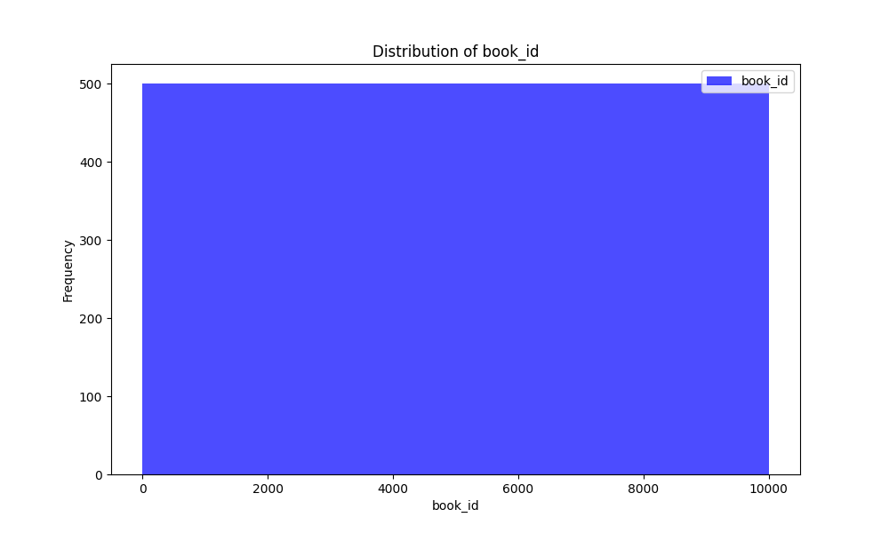
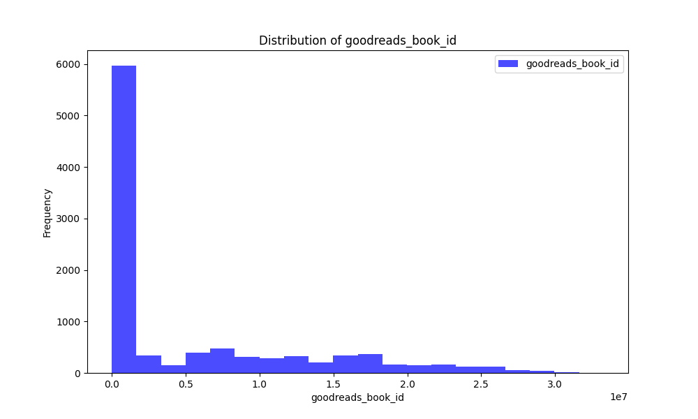
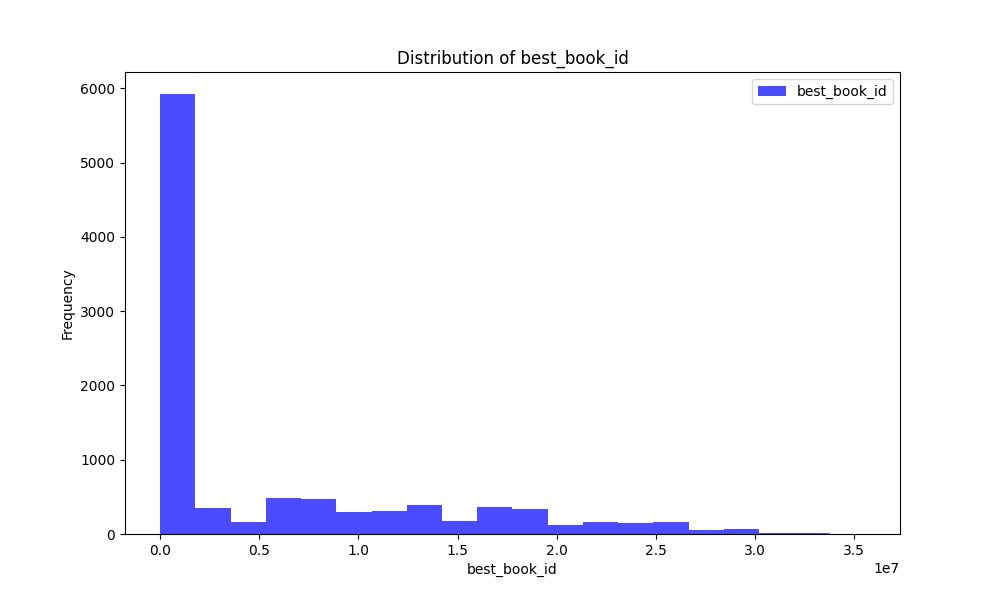

# Automated Data Analysis Report

## Narrative

The dataset in question contains a total of 10,000 entries across 23 columns, primarily focused on books, their authors, and their associated ratings and reviews from Goodreads. Understanding this dataset can yield insights into reading trends, popular books and authors, and the overall landscape of published literature.

### Data Structure Overview
The dataset is composed of various columns encompassing information such as `book_id`, `goodreads_book_id`, `title`, `authors`, `average_rating`, `ratings_count`, as well as several rating breakdowns (like `ratings_1` to `ratings_5`). The presence of both integer and float data types suggests that quantitative assessments (like ratings and publication years) are key components of the dataset. There are also several string (object) columns that capture categorical data about books (e.g., `title`, `author`, `isbn`).

### Missing Values Assessment
While the dataset appears to be largely complete, there are notable gaps:

- **ISBN Numbers**: A total of 700 entries are missing ISBN values, which may hinder the ability to precisely identify books, especially if cross-referencing with external databases.
- **ISBN13**: Similar to ISBN, with 585 entries missing this identifier.
- **Original Publication Year**: There are only 21 entries lacking this attribute, which suggests the majority of books have a well-documented publication history.
- **Original Title**: 585 entries are missing the original title, which might be important for certain translations or editions.
- **Language Code**: A more significant gap exists here, with 1,084 entries missing the language designation. This raises concerns about the dataset's ability to represent multilingual literature comprehensively.

### Patterns and Trends
1. **Rating Distribution**: The columns `ratings_1` to `ratings_5` indicate a structured method of capturing users' ratings. Analyzing these would allow for a nuanced exploration of how books perform in terms of reader satisfaction. A potential trend may reveal if higher average ratings correlate with higher ratings count, indicating a more popular consensus.

2. **Publication Trends**: Given that `original_publication_year` is recorded, one could plot the distribution of books published over the years to observe cyclical trends in publishing. This might highlight years with peak publishing activity, potentially correlating with significant cultural or literary movements.

3. **Diversity of Authors and Languages**: Analyzing the `authors` and `language_code` columns, we may observe diversity in authorship and the availability of books in different languages. This can highlight representation (or lack thereof) in the literary landscape.

4. **Average Ratings Insight**: Books with high average ratings, especially those with substantial ratings counts, could indicate bestsellers or critically acclaimed works. These insights could inform publishers and booksellers about market preferences.

### Anomalies
- The discrepancies in the data related to missing language codes and ISBNs can be an anomaly. The absence of language codes, especially, may skew understanding of the global reach of the literature represented in this dataset.
- The dataset’s completeness regardingBook and author identifiers (e.g. book_id) suggests that the significant missing values may come predominantly from aggregated data or less curated entries, which occasionally dilute resolution.

### Potential Use Cases
1. **Market Analysis for Publishers**: Publishers could utilize this dataset to identify trends in consumer ratings and preferences, guiding them on future genres or author contracts to pursue.
  
2. **Academic Research**: Researchers can leverage the dataset for literary analysis, exploring how authorial reception varies by genre or demographic represented in the books.

3. **Recommendation Systems**: Machine learning algorithms could be designed to create personalized book recommendations based on user ratings patterns in the dataset, improving user experience on platforms like Goodreads.

4. **Translation Opportunities**: With insights into which books are not only highly rated but were also published over time without corresponding translations (examined through language codes), opportunities for translation and localization can be identified.

5. **Content Marketing**: Book marketers could draw on the data to support targeted campaigns for high-potential books, particularly those that exhibit a strong rating profile but may not have gained widespread visibility.

In summary, this dataset is a rich resource for understanding book metrics and consumer trends, although attention must be given to missing values, especially in key identifiers and language data, to enhance its utility. Insights drawn from thorough analysis can inform various sectors within the literary ecosystem.## Visualizations

