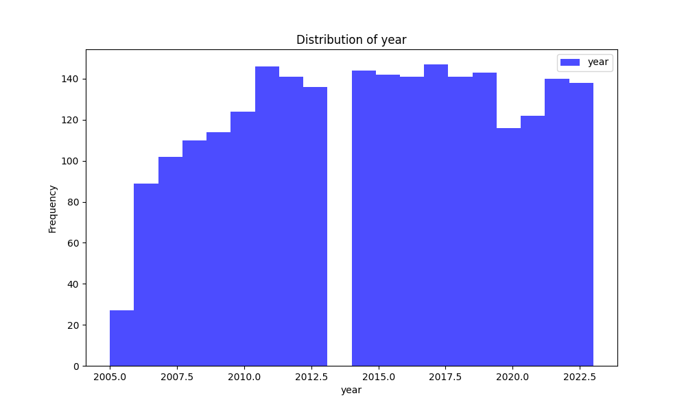
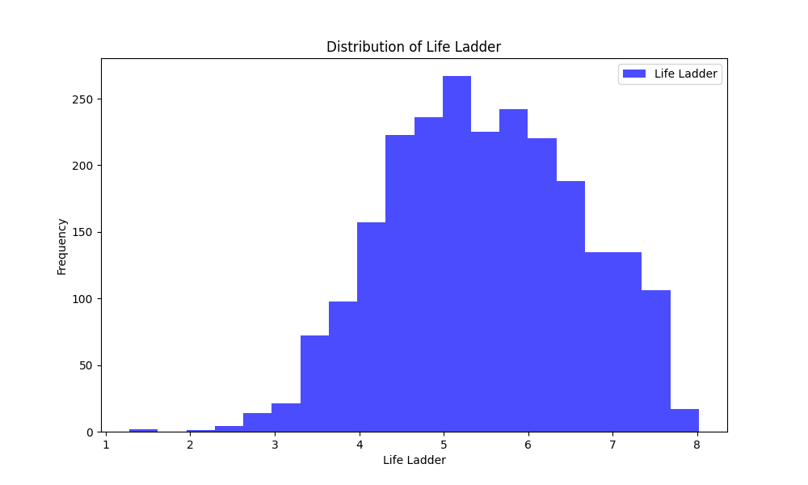
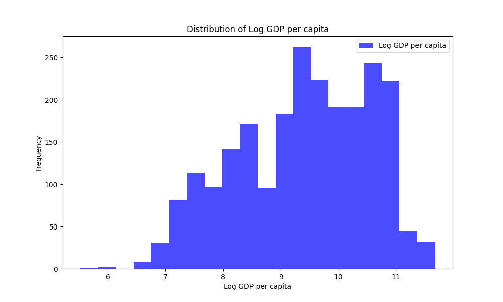

# Automated Data Analysis Report

## Narrative

Based on the dataset summary you provided, we can draw several insights into its structure, underlying patterns, trends, and potential anomalies. The following narrative encapsulates these observations and suggests relevant use cases.

### Dataset Overview

With 2,363 rows and 11 columns, this dataset appears to encompass a variety of social, economic, and well-being indicators from different countries across various years. The columns consist of:

1. **Country Name**: The name of the country.
2. **Year**: The year of observation.
3. **Life Ladder**: A measure of subjective well-being.
4. **Log GDP per Capita**: A logarithmic scale of GDP per capita, indicating economic prosperity.
5. **Social Support**: A measure of perceived support in the community.
6. **Healthy Life Expectancy at Birth**: Average number of years a newborn is expected to live in good health.
7. **Freedom to Make Life Choices**: A measure of autonomy in life choices.
8. **Generosity**: A measure of charitable behaviors.
9. **Perceptions of Corruption**: A measure of the corruption perceived in society.
10. **Positive Affect**: A measure of positive emotions experienced.
11. **Negative Affect**: A measure of negative emotions experienced.

### Missing Values

There are instances of missing values across several columns:

- **Log GDP per Capita** has 28 missing values, indicating some countries in specific years may not have reliable economic data available.
- **Social Support** and **Freedom to Make Life Choices** also have missing data, 13 and 36 respectively, which may suggest issues in data collection or reporting.
- Notably high missing values are observed for **Generosity** (81), **Perceptions of Corruption** (125), and **Healthy Life Expectancy at Birth** (63). The higher missing rates may reflect challenges in measuring social behaviors or health outcomes in certain contexts.

### Analyzing Patterns and Trends

1. **Economic and Well-being Correlation**: Given that the dataset includes both GDP indicators and life ladder scores, a potential pattern may arise illustrating the correlation between economic wealth and life satisfaction. Countries with higher log GDP per capita may exhibit a higher Life Ladder score.

2. **Social Support Impact**: As social support is a strong predictor of well-being, it would be beneficial to investigate whether countries with higher scores in social support correlate with higher Life Ladder rankings as well.

3. **Generosity and Happiness**: The low count of non-missing values in the Generosity column could highlight a potential gap in understanding charitable behaviors in different countries and their impact on subjective well-being.

4. **Yearly Trends**: An analysis of how these indicators change over the years can provide insights into trends. For instance, examining the changes in well-being correlated with economic downturns or recoveries might reveal resilience patterns in different societies.

5. **Negative and Positive Affect**: Comparing negative and positive affect across various countries could yield insights into the emotional landscape and societal factors influencing happiness.

### Potential Use Cases

Given the richness of the data, there are multiple potential applications:

1. **Policy Making**: Governments can utilize insights related to social support, freedom to make life choices, and perceptions of corruption to frame policies aimed at enhancing citizen well-being and addressing sociopolitical issues.

2. **Economic Development Programs**: Organizations focusing on economic development can use GDP and life expectancy data to target interventions more effectively, especially in nations with significant socio-economic disparities.

3. **Health and Wellness Research**: The combination of life expectancy data and subjective measures of well-being can enable public health researchers to correlate health interventions with societal happiness metrics.

4. **Global Comparison Studies**: NGOs and international organizations can leverage this dataset for global comparisons regarding happiness and prosperity, fostering collaborative programs to tackle systemic issues identified through the data.

5. **Social Sciences Research**: Academics in fields like sociology or psychology can employ this dataset to analyze the interplay between economic, social, and psychological variables in diverse cultural contexts.

### Conclusion

This dataset provides a multifaceted view of the interactions between economic and social factors affecting human well-being across various countries and years. By harnessing sophisticated statistical techniques and machine learning, deeper insights could unfold, fostering a comprehensive understanding of societal dynamics, ultimately paving the way for informed policy-making and academic research.## Visualizations

