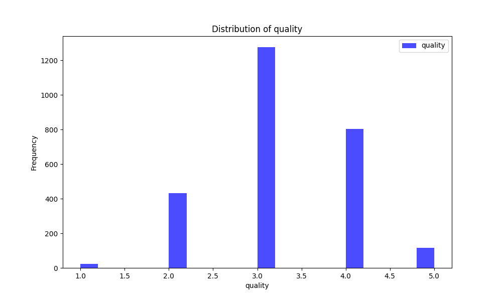

# Automated Data Analysis Report

## Narrative

### Dataset Overview

The dataset consists of 2,652 rows and 8 columns, which encapsulate information related to ratings or evaluations of various items, potentially reviews or assessments in a certain field (such as products, movies, reports, etc.). The columns include the following key categories of information:

1. **Date**: The date on which the observation was recorded.
2. **Language**: The language of the observation (e.g., review).
3. **Type**: The category of the item being evaluated.
4. **Title**: The title of the item.
5. **By**: The author or reviewer of the item.
6. **Overall**: An integer score representing the overall rating (on some scale).
7. **Quality**: An integer score reflecting the quality aspect of the item.
8. **Repeatability**: An integer score indicating the repeatability of the item (possibly relating to whether the outcome can be reproduced).

### Missing Values

There are some noteworthy missing values in the dataset:
- **Date**: 99 missing entries, which is about 3.74% of the data. This could potentially limit time series analysis or tracking trends over time.
- **By**: 262 missing entries, approximately 9.87%. Since this column represents the reviewer, a significant portion of the data lacks information about the source of the review, which could affect creditability assessments or biases in scoring.

The other columns do not exhibit any missing values, making them reliable for operations that do not depend on the presence of data in the 'date' or 'by' columns.

### Patterns and Trends

1. **Time-based Evaluation**: With a considerable number of missing entries in the date column, one might need to address this before running time-based analysis. Depending on the context, incorporating placeholders or the use of data imputation methods for the 'date' could help retain observations in longitudinal studies.

2. **Language and Type Distribution**: The consistent presence of data across the 'language' and 'type' columns indicates a rich diversity in the dataset. Analysis could reveal which languages or item types have the most reviews, potentially identifying demographic or cultural trends.

3. **Review Trends**: The presence of 'overall', 'quality', and 'repeatability' ratings can be analyzed to discover patterns:
   - **Correlation Analysis**: It would be insightful to compute correlations between 'overall', 'quality', and 'repeatability'. A high correlation between overall ratings and quality could indicate that items rated higher in quality are also favored in overall scoring.
   - **Rating Distribution**: Analyzing the distribution of these ratings could reveal biases, outliers, or areas of concern within the dataset.

4. **Reviewer Anonymity**: The high count of missing data in the 'by' column could mean many reviews may not have a specified source. This could potentially skew analysis if a substantial volume of reviews’s credibility cannot be established.

### Anomalies

- **Missing Reviewer Data**: The high percentage of missing entries under the 'by' column invites scrutiny. If a significant number of reviewers do not have identifiable information, it calls into question the reliability of the ratings and whether the reviews are authentic.
- **Date Gaps**: Depending on how the data is structured chronologically, missing dates could lead to irregularities in trend analysis or understanding time-limited responses.

### Potential Use Cases

1. **Sentiment Analysis**: By analyzing titles and the associated ratings, sentiment analysis can be conducted to assess general public perception of items across various categories and languages.
  
2. **Quality Improvement Feedback Loop**: The dataset can support businesses in improving their products or services by identifying common points raised in lower 'quality' and 'repeatability' scores. 

3. **Market Research**: Insights drawn from the language and type of reviews could reveal emerging trends in preferences within specific demographics or under certain conditions.

4. **Time Series Analysis**: Once the date issues are resolved, examining how ratings change over time could help businesses strategize on product launches or improve marketing campaigns.

5. **Predictive Modeling**: Developing machine learning models based on the provided ratings could forecast future performance of similar items or predict overall ratings based on historical trends.

In summary, while the dataset presents rich opportunities for analysis, it is critical first to process missing values effectively, ensuring valid interpretations of the collected information.## Visualizations

